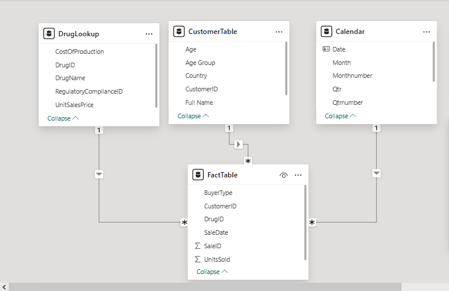

# Drug Sales Analysis

### Introduction
---
Using **Power BI Desktop**, I transformed, modeled, and visualized the data to uncover trends, identify top and underperforming products/customers, and highlight key revenue drivers.
The report consists of three pages:
1. Top/Bottom Analysis
2. Customer Analysis
3. Trend Analysis

### Problem Statement
---
-	Monitor overall sales performance and profitability
- Identify top-performing and underperforming drugs/customers
-	Understand customer demographics and buying patterns
-	Track sales trends over time for strategic planning

### Skills Demonstrated
---
-	Power BI Desktop
-	DAX for calculated measures
-	Power Query (M) for data transformation
-	Excel / CSV for source data
-	PowerPoint for designing dashboard template

### Data Sourcing
---
The data was downloaded in CSV file, and extracted it into Power BI for cleaning, analysis, and visualization.
It contains 3 sheets/tables:
1. DrugLookup with 41 rows and 6 columns
2. Customer with 201 rows and 7 columns
3. Fact(Order) with 16315 rows and 6 columns

### Data Transformation
---
Data was efficiently cleaned and transformed with the Power Query Editor of Power BI. Some of the applied steps include:
- Promoted first rows as headers in the Fact, Customer and Drug Table.
- Merged columns of first and last names to get the full name of each customer in the Customer Table
- Removed column, othercustomerinfo, as it was not necessary for the analysis in the Customer table.
- Added conditional column, Age Group, in the Customer table.
- Removed column, Treat, as it was not necessary for the analysis in the Drug table.
- Datatype change to TEXT.

### Data Modelling
---

I manually connected relatable tables resulting in a star schema model and they are as follows: 
- The DrugID in the DrugLookup Table connected to the DrugID in the FactTable
- The CustomerID in the Customer table connected to the CustomerID in the FactTable 
- The Date in the Calendar table connected to the SalesDate in the FactTable

### PowerPoint Templates
PPt Top/Bottom    |    PPt Customer    |    PPt Trend    |    PPt Tooltip
:-----------------:|:------------------:|:--------------:|:--------------:
|||

This were the customized layouts used for each of the reports created in PowerPoint.

### Analysis and Visualization

#### Top/Bottom Dashboard
Top/Bottom Dashboard view    |    Top/Bottom Dashboard with open filter panel
:----------------------------:|:-------------------------------------------:
.png)|.png)

- In February, the business experienced a decline compared to January across the overall sales performance while profit margins remained fairly stable even though it had a minor dip of -0.21%
- Lisinopril contributed 5.0% of total revenue as the top leading drug sales, making it the leading revenue driver.
- On the otherside, Warfin, the overall least sold, accounted for less than 1% of sales, despite taking up significant shelf space.
- David Johnson highlighted as the top customer contributed 5.6% of total revenue. Though despite it being small have a disproportionately high impact on revenue. 
- Carol Smith accounted for less than 1% of sales that made the least revenue.
- Top/Bottom Dashboard with open filter panel, displays the same dashboard but with the filter panel to make it clear to the end user that filters (slicers for Month and Year) are available and can be used to customize the analysis.

#### Customer Dashboard

Customer view 1    |    Customer view 2   |  Customer view 3   
:-----------------:|:------------------:|:--------------:
.png)|.png)|.png)

- A total of 200 customers generated a total revenue of $65M averaging of $323K per customer shows that a relatively small customer base contributes significantly large amounts to overall sales.
- As it is shown in the buyer type, the business is heavily dependent on the sellers which accounts for 88% of revenue while users contribution remain relatively small.
- 51+ and 31-40 age groups shows that revenue share is significantly skewed to mainly older customers.
- Gender contribution are more balanced, with males leading slightly.
- The business is highly dependent on Canada and Australia for the majority of its revenue. 
- This view presents the dashboard with Revenue by Country shown as a bar chart.
- It highlights revenue comparisons across countries in a simple, clear format.
- The Revenue by Country is shown in this view as a map visualization instead of a bar chart, and shows the hover tooltip on the Revenue by Age Group chart.
- The geographic distribution allows users to quickly identify regional performance patterns.
- This screenshot shows the hover tooltip on the Revenue by Age Group chart.
- The tooltip dynamically displays: 
- The age group name being hovered on
- The total revenue (in dollars) for that age group
- The top three drugs purchased within that age group along with their revenues
- This tooltip provides deeper, context-specific insights that go beyond the static chart visuals.
- This version displays the Revenue by Country as a bar chart (reintroducing the earlier format).
- It also demonstrates the customized tooltip functionality: when hovering over a country bar, the tooltip dynamically shows:
- The country name being hovered on
- The total revenue (in dollars) for that country
- The top three drugs in that country and their respective revenues

#### Trend Dashboard

Trend Dashboard view 1   |    Trend Dashboard view 2
:----------------------------:|:-------------------------------------------:
.png)|.png)

- The growth from the year 2022 to 2023 shows shows high market expansion, but quarterly spreads suggest Q3 is the most productive period.
- In months February (-23.8%), August (-19.0%), and October (-12.5%) sharp declines occured signaling periods of weakened sales performance.
- Strong rebounds followed these declines, particularly in March (+20.9%), July (+16.3%), and September (+22.2%), showing recovery potential.
- Fridays ($10.3M) drive the highest sales shows that weekday shopping behavior peaks at the end of the workweek.
- From the heatmap analysis of top-selling drugs, Clonazepam consistently ranked as a high performer, while Ezetimibe and Lisinopril recorded very low contributions across weekdays.
- This view displays the entire dashboard with Revenue by Weekdays shown in a column chart.
- This view displays the filter panel (slicers for Country and Gender) is expanded, so viewers can see the available filtering options. 
- The Weekdays earnig and top-5 drugs is visualized as a heatmap, making it easier to identify drug performances varied by day.

### Recommendation

